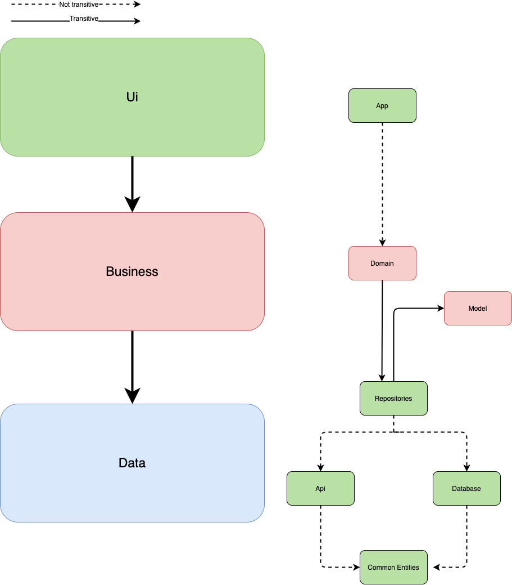

# Android - Clean Architecture - Kotlin []  In construction
Project based on CleanAndroidArchitecture from Android 10 the target is update the project and modularized.
All credit to original project.  This project is based on MVVM architecture and written with Kotlin.

# Targets

Done
 - Update coroutines
	 - Some  problems with coroutines was solved, added new Flow to give more options.
 - Update Kotlin
	 - Update Kotlin to the last version.
 - Persistence database
	 - Added Room as database manager ORM and create new entitys to persist data
 - Bitrise as Integration server
	 - Configure project with Bitrise CI, this build and execute the test.

# Modularized project

 Project is based on layer, good for project because become project too strong with single responsability principle and close solids principle. I was inspired by the [Google's presentation](https://www.youtube.com/watch?v=PZBg5DIzNww&t=1064s) also I used a lot of references like.

>
> https://proandroiddev.com/using-dagger-in-a-multi-module-project-1e6af8f06ffc
> https://medium.com/androiddevelopers/dependency-injection-in-a-multi-module-project-1a09511c14b7
> 	 https://github.com/Teamwork/android-clean-architecture

The architecture is divided in layers UI - Business - Data

The layers at the same time are divided in modules in order a team would be able to work in different modules without problems.

 - Ui
	 - App
- Business
	- Business
	- Model
- Data
	- Api
	- Database
	- Common objects

**App**
	This module contains code ui Activitys, Fragments etc.

**Business**
 Contains all model logical, here will be place all code like Use cases algorithms etc

**Model**
Model application commonly called POJO.

**Api**
Retrofit calls or another related logic with server datasource.

**Database**
All access to database in this module, also I include in this module the access to preferences or files.

This modules are organized in order to help the good using of the solid principles.

# Todo

- Some examples code was broken I will fix in the next iteration.
- Added Navigation jetpack library and migrate the code to single activity architecture.
 - Coroutines cancelation (see https://medium.com/androiddevelopers/cancellation-in-coroutines-aa6b90163629)
 - Better test's coverage
 - Espresso test interface
 - Fastlane
 - Firebase test labs
 - Change "UseCase" to new (see https://github.com/google/iosched)

# Third party libraries

 - Kotlin
 - Kotlin Coroutines
 - Retrofit
 - DataBinding
 - Timber
 - Paging library Android
 - Glide
 - Android debug database
 - Dagger
 - Room

# Test libraries

 - Roboelectric
 - Mockito
 - Kluent
 - Assertk
 - Leak Canary

# Users example

    email: ruben.garcia@gmail.com
    password: 12345
    Role: Admin

    email: rafael.martin@gmail.com,
    password: 123456
    Role: Technical
    Skills: COLLECTOR

    email: sarah.lopez@gmail.com,
    password: 1234567
    Role: Technical
    Skills: PRODUCT_SUPPLIER,WRAPPER

For add more user go to UserSampleData.json

## Based on # [Android - Clean Architecture - Kotlin](https://github.com/android10/Android-CleanArchitecture-Kotlin) :

## License

    /*
     *
     *  * Copyright 2020 Cristian Menárguez González
     *  *
     *  * Licensed under the Apache License, Version 2.0 (the "License");
     *  * you may not use this file except in compliance with the License.
     *  * You may obtain a copy of the License at
     *  *
     *  *    http://www.apache.org/licenses/LICENSE-2.0
     *  *
     *  * Unless required by applicable law or agreed to in writing, software
     *  * distributed under the License is distributed on an "AS IS" BASIS,
     *  * WITHOUT WARRANTIES OR CONDITIONS OF ANY KIND, either express or implied.
     *  * See the License for the specific language governing permissions and
     *  * limitations under the License.
     *
     *
     */